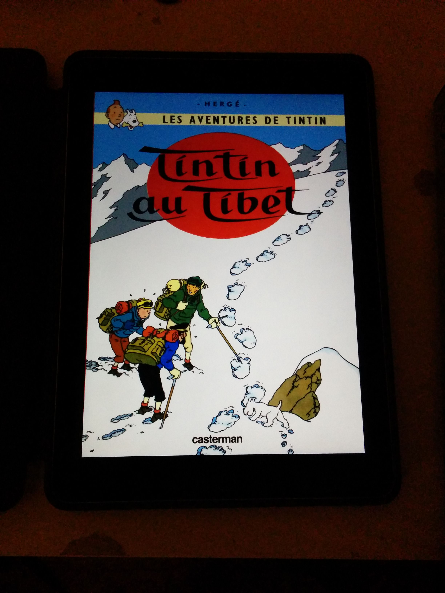
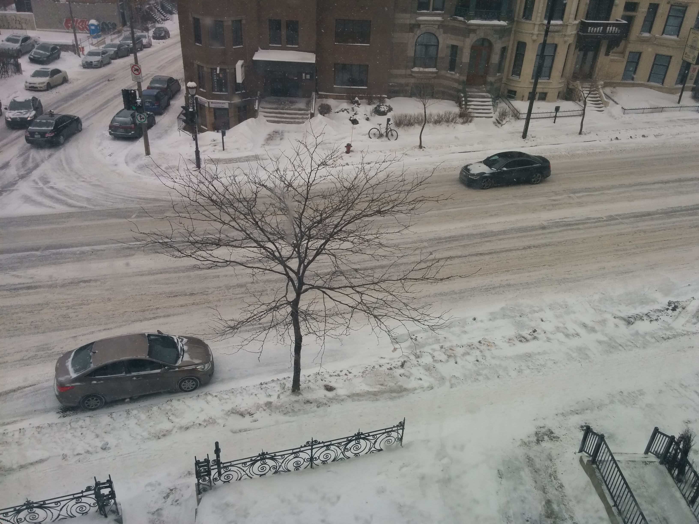
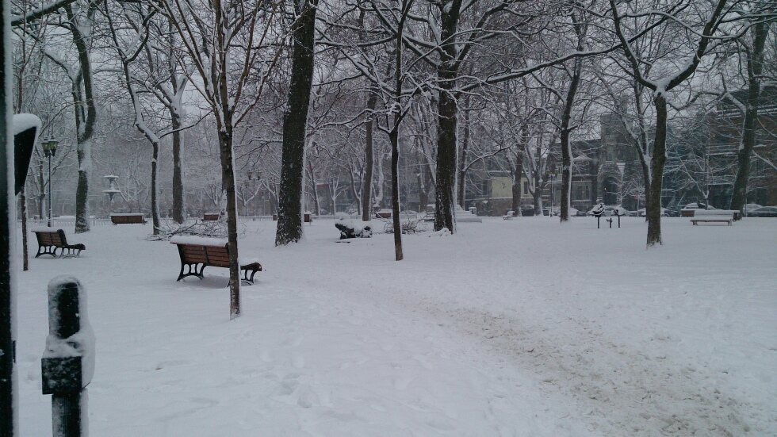
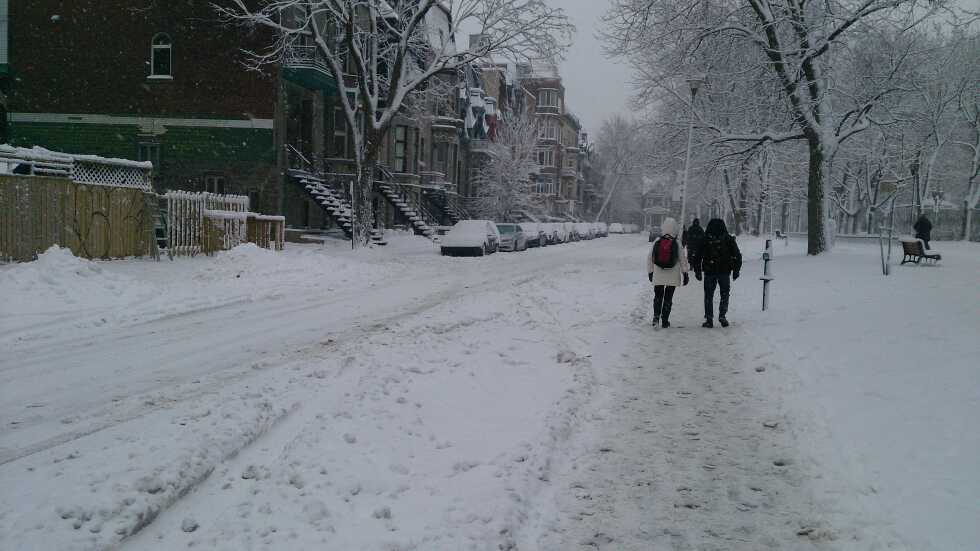
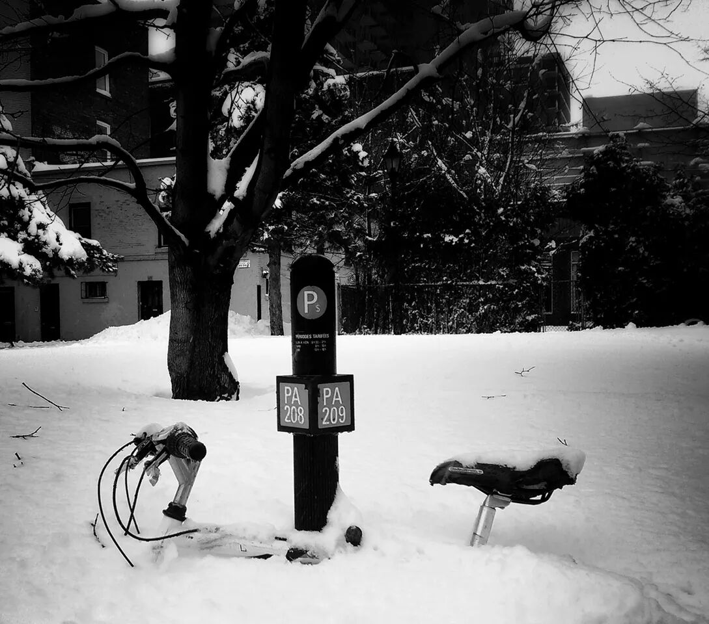

## বিলেত - বরফ বিষয়ক

নিজেকে কথা দিয়েছিলাম, মরসুমের শেষ না দেখা অবধি বরফের কথা বলে আদিক্ষেতা করব না। কথা রেখেছি। 

দিন সাতেক হল বরফ পড়া পুরোপুরি বন্ধ হয়েছে। হিসেব কষে দেখতে গেলে, প্রায় ছমাস ধরে বরফ আর শীতকাল উপভোগ (?) করলাম। এখন রাস্তাঘাটের সব বরফই গলে গেছে, শুধু অ্যাদ্দিন ধরে ছড়ানো  নুন আর নুড়ি স্তূপ হয়ে জমে আছে জায়গায় জায়গায়। 

বাঙালীর বরফ বলতে দৌড় ওই দার্জিলিং অবধি। অথবা মাঝেসাঝে সিমলা-কুলু-মানালি বা সিকিম-গ্যাংটক। তাই বরফ নিয়ে আমারও যে একটা আদেখলেপনা থাকবে - সে আর আশ্চর্য কী? তবু সত্যি বলতে কি, শেষের দিকে আর পোষাচ্ছিল না - বিরক্তি ধরে গেছিল! দেশ থেকে বন্ধু যখন ফোনে উচ্ছ্বসিত হয়ে বলত : "বলিস কী? এপ্রিলেও বরফ পড়ছে? দারুণ মজার ব্যাপার তো!", তখন রেগেমেগে ঝাঁঝিয়ে উঠে দু-চার কথা শুনিয়ে দিয়েছি। 

শাস্ত্রে বলেছে মধুরেণ সমাপয়েৎ। তাই বরফ-বিরক্তি টুকু প্রথমে সেরে নিলাম। শীতের শুরুতে ভালোলাগার যে খসড়াগুলো জমেছিল, সেগুলো একসাথে জড়ো করে নিচে সেঁটে দিলুম। আর তার সাথে কিছু ছবি।

* 	* 	* 

ইউনিভার্সিটি তে ঢুকে মনে হল এক্কেবারে Hogwarts! নেহাত ক্লাসে যাবার তাড়া ছিল, নয়তো ওখানে দাঁড়িয়েই ছবি তুলে একখানা দেখবি-আর-জ্বলবি-লুচির-মতো-ফুলবি মার্কা টুইট করা যেত। 

অ্যাদ্দিন গল্পের বই আর সিনেমাতে যা যা পড়েছি দেখেছি, স-অ-ব সত্যি। তবে এটা ভাবিনি যে ক্লাসে ঢোকার আগে বাথরুমে গিয়ে দাড়ি থেকে বরফকুচি ঝাড়তে হবে! 

* 	* 	* 

পুরো তিব্বতে টিনটিন! 

খালি খালি দেশের বন্ধুদের কথা মনে পড়ছে। বারবার পকেট থেকে মোবাইল বার করে ফটো আর ভিডিও তোলার চেষ্টা করছি - পাঠাবো বলে - কিন্তু একটাও যুতসই হচ্ছে না। সব ডিলিট করে দিচ্ছি। ওই মুহূর্তের মজাটা রেকর্ড করতে পারছি না কিছুতেই। 

হাঁটতে হাঁটতে মাঝেমধ্যেই "উফ্‌ কি দারুণ সুন্দর! এখনো বিশ্বাস হচ্ছে না" টা "ইইইইরক্‌, কি পিছল রে বাবা! এর উপর দিয়ে লোকে হাঁটে কী করে?" হয়ে যাচ্ছে। 

পায়ের নিচে শক্ত পিছল বরফ, চারপাশ দিয়ে কনকনে হাওয়ার ঝাপটা, আর উপর থেকে হাল্কা হাল্কা বরফকুচি - তার মধ্যে আবার একদল আছে যারা পড়ছে না, খালি পাক খেয়েই যাচ্ছে, মাটিতে পা ফেলার কোনো ইচ্ছেই নেই বোধহয়।

* 	* 	* 

রাতের বেলা মাঝে মাঝে যখন বরফ পড়ে, আকাশটা অদ্ভুত রকম ফ্যাকাসে হয়ে যায় - ঠিক সাদা নয়, বোধহয় খানিকটা লালচে মতো - বুঝিয়ে বলা কঠিন। ছোটবেলায় সেই যে জলভরা ডোমের খেলনায় নকল স্নো-ফল দেখতাম, ঠিক মনে হয় সেইরকম কোনো ডোমের ভিতর যেন আছি। আর উপর থেকে সাদা সাদা ঝুরি ঝুরি বরফ পড়তেই থাকে। ঘরের আলো নিভিয়ে ঘণ্টার পর ঘণ্টা জানলা দিয়ে খালি তাকিয়ে থাকতে ইচ্ছে করে, পড়তে বসার তাড়া মাথায় আসে না। 

* 	* 	*

বৃষ্টি পড়াটা খুব একটা দেখা যায় না। মানে, তুই তাকিয়ে তাকিয়ে দেখতে পাবি না, বড়জোর বৃষ্টিতে চারপাশ কির'ম ঝাপসা হয়ে গেছে সেটা দেখবি। কিন্তু বরফ - চাইলে প্রত্যেকটা কুচিকে ফলো করতে পারবি। 

ঘরের ভিতর ফ্যানের হাওয়ায় প্লাস্টিক ব্যাগ উড়তে দেখেছিস? এলোমেলো উড়তে থাকে - বরফগুলোও ঠিক ওইরকম। এবার ভাব, কোটি কোটি বরফকুচি ঘুরে ঘুরে বেড়াচ্ছে তোর বেছে নেবার জন্য - সবার আলাদা আলাদা পথ। 

ম্যাজিক বললে কম বলা হয়। ঘোর নেশার জিনিস।  

* 	* 	* 

প্রাসঙ্গিক। নানাভাবে।

* 	* 	* 

বেডরুমের জানলা থেকে।

* 	* 	* 

চেনা যাচ্ছে? গতবার এই পার্কেরই Fall এর চেহারা দেখিয়েছিলাম। 

* 	* 	* 

* 	* 	* 

শেষের এই ছবিটা তুলেছে [ রোহন ](https://www.rohanrc.com/)। 

* 	* 	* 

[Archive](../archive)
