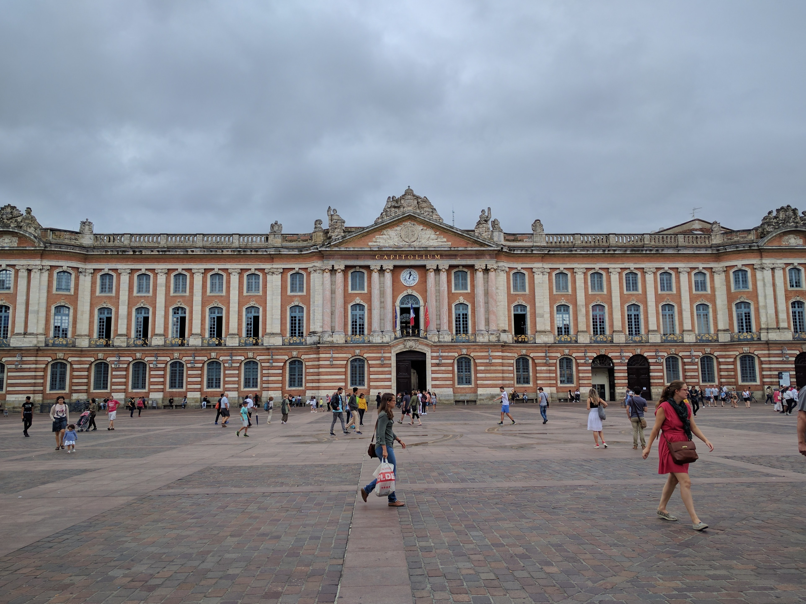
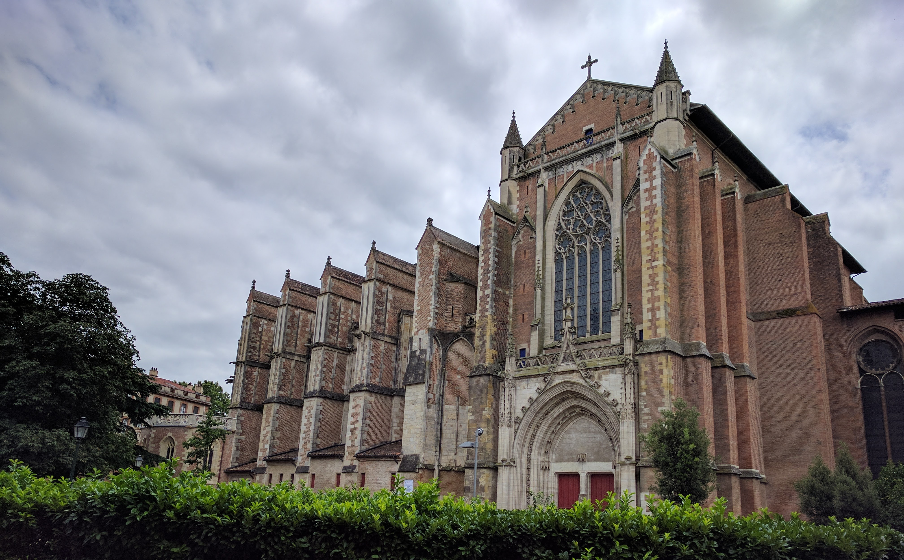
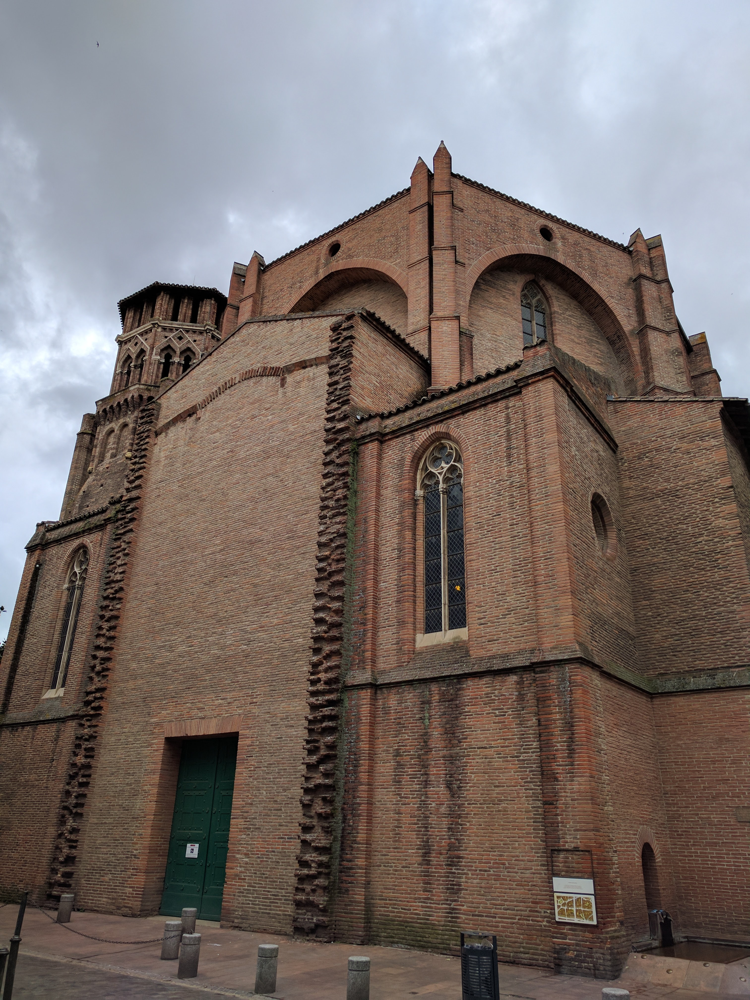
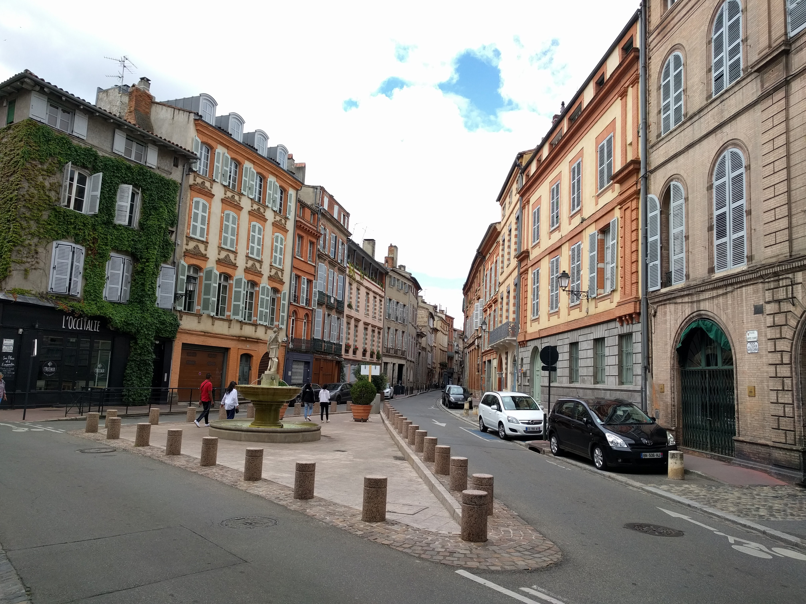
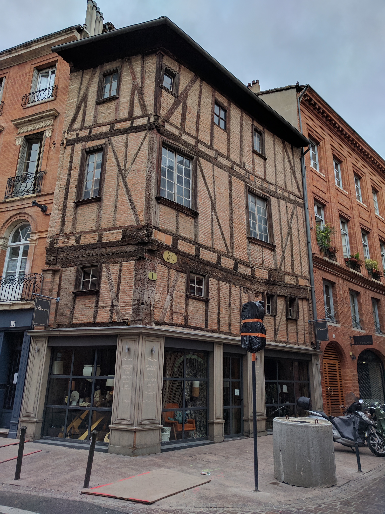
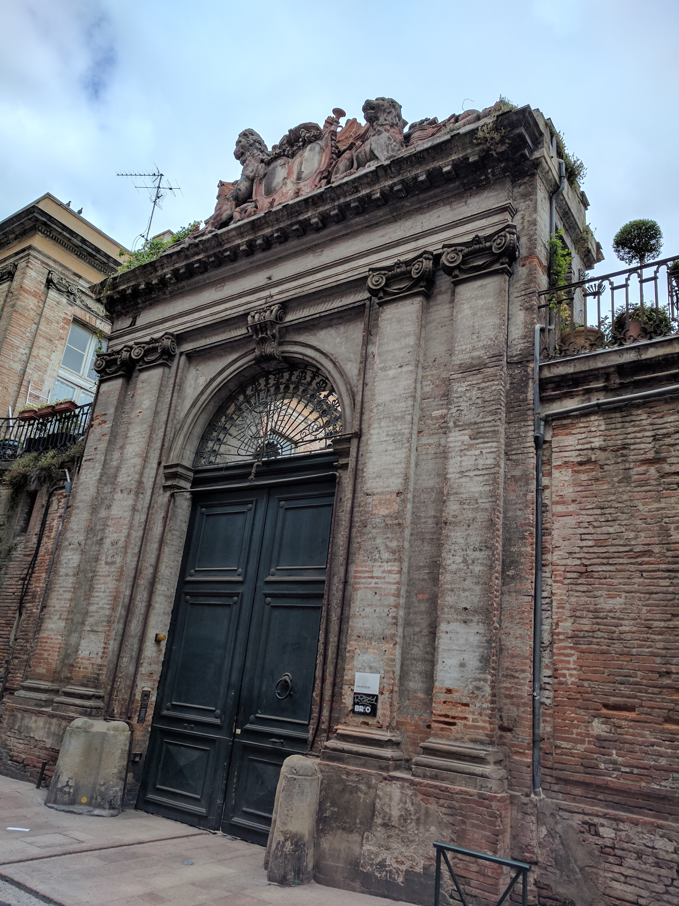
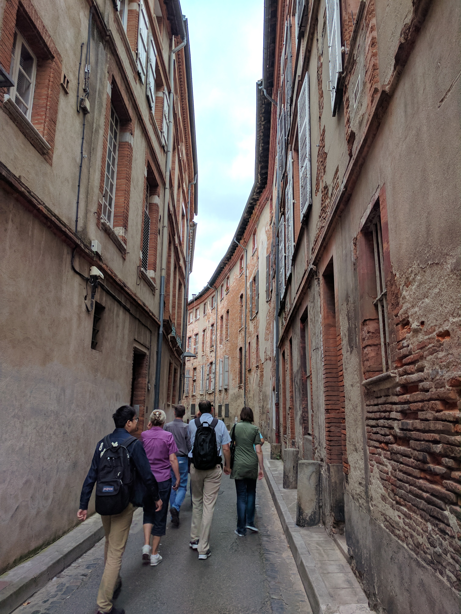
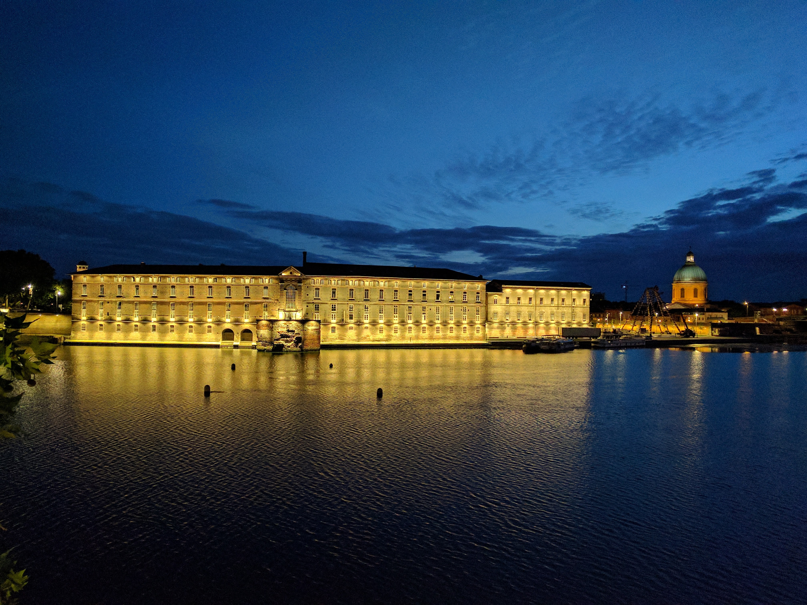

## ফ্রান্স - ৫

তুলুসের ডাকনাম "গোলাপি শহর"। এখানকার প্রায় সব বাড়িঘর ইটের তৈরি। আর সেই ইটের উপর পলেস্তরার প্রলেপ বেশিরভাগ ক্ষেত্রেই পড়েনি। কিছু বাড়ি এককালে চুনকাম করে সাদা করে দেওয়া হলেও পরে আবার সেসব ঘষে ঘষে তুলে দেওয়া হয়েছে - শহরের টেরাকোটা স্থাপত্যের ঐতিহ্য বের করে আনার জন্য। তবে, এই লালচে ইটের রঙের জন্যই গোলাপি নামকরণ - এটা একটা বহুলপ্রচলিত কিন্তু ভুল ধারণা।

এককালে ফ্রান্সে কম্যুনিস্ট আন্দোলনের ডেরা ছিল এই তুলুস। "লাল শহর" শুনতে বেশী মারকুটে লাগে বলে একটু হাল্কা করে নিয়ে সেই থেকে "গোলাপি" নাম চালু। পরবর্তীকালে নামকরণের রাজনৈতিক কারণটা অপ্রাসঙ্গিক হয়ে পড়ে; পুরনো ডাকনামটাকে পর্যটনের নতুন মোড়কে মুড়ে নিয়ে বেচা শুরু হয়। ভালো করে খেয়াল করে দেখবে, এখানকার ইটের রং আদৌ গোলাপি নয়, বরং খানিকটা লালছে-কমলা। তবু আজকাল এই দেখিয়েই "গোলাপি শহর" বলে চালানো হয়।

এতটা বলতে বলতে একটু হাঁপিয়ে পড়েছিলেন আমাদের গাইড। মধ্যবয়সী, মোটাসোটা মহিলা। সকাল থেকে অন্য আর এক দলকে নিয়ে ঘুরিয়ে দেখিয়েছেন চারিপাশ। এখন আবার সন্ধ্যেবেলা আমাদের নিয়ে বেরিয়েছেন। চোখেমুখে ক্লান্তির ছাপ স্পষ্ট, কিন্তু উদ্যমে ঘাটতি নেই একটুও। একের পর এক গল্পের ছলে আমাদের নিয়ে এগিয়ে চলেছেন শহর আর শহরের ইতিহাসের মধ্যে দিয়ে। এইসব গল্প শুনব বলেই না বেড়াতে আসা! কী ভাগ্যিস এই walking tour টায় নাম লিখিয়েছিলাম! সন্ধ্যেবেলার ট্যুর, ৮টা নাগাদ জমায়েত হয়েছিলাম আমরা। নামেই সন্ধ্যা, গ্রীষ্মে এই সময়ে রাত নটার পরেও আলো থাকে। তবে ঘুরতে ঘুরতে আলো নিভে এলো, আর ট্যুরটার নামটাও স্বীকৃতি পেল - “Toulouse under the Moonlight!'

* * *

[(চলবে)](../posts/2017-07-14-France-6)

* * *

[Archive](../archive)
