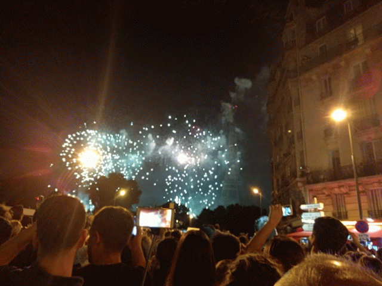
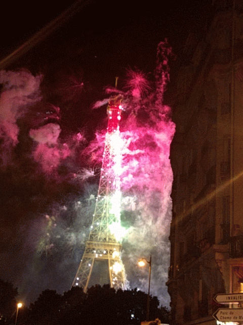
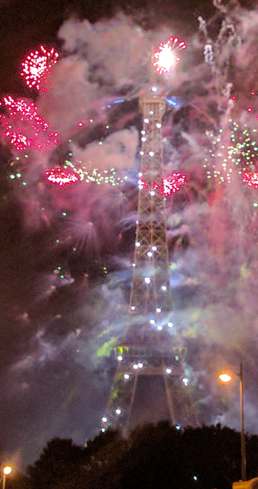

## ফ্রান্স - ৬

প্যারিস। বা সঠিক উচ্চারণে, পারী। এটাও পুরোপুরি ঠিক হল না। ফরাসিতে র অনেকটা হ-এর মতো শোনায়, গলা খাঁকড়িয়ে আওয়াজ বার করতে হয়। আয়ত্ত করতে আমার সপ্তাহ দুয়েক লেগেছিল, তোমাদের দু মিনিটে আর কী করে বোঝাব? 

কথা ছিল বিকেল নাগাদ প্যারিস পৌঁছব, তারপর ঘণ্টা খানেক পায়ে হেঁটে একটু ঘুরব। কিন্তু বিধি বাম! তুলুস থেকে প্যারিস আসার প্লেনের টায়ার পাঙ্কচার। ইয়ার্কি নয়, সত্যি! তুলুস এয়ারপোর্টে প্লেনে উঠবো বলে বোর্ডিং ব্রিজে সবাই লাইন দিয়ে দাঁড়িয়ে আছি, এমন সময়ে ক্যাপ্টেন এসে জানালেন - চাকার রাবারে এক ইঞ্চি লম্বা একটা ফাটল দেখা গেছে; ওই ঝুঁকি নিয়ে তিনি উড়বেন না, তাই চাকা পালটাতে নির্দেশ দিয়েছেন। সেসব মিটতে প্রায় দু ঘণ্টা লেগে গেল। 

পারিসের হোস্টেলে যখন এসে পৌঁছলাম, তখন বাজে প্রায় সাড়ে আটটা। প্রচণ্ড খিদে পেয়েছিল, তাড়াতাড়ি ডর্মিটরিতে স্যুটকেস রেখে এসে হোস্টেলের লাগোয়া বারে গিয়ে বার্গার আর ফ্রাইস দিয়ে চটজলদি ডিনার সারলাম। তারপর দেখলাম আরও আধঘণ্টা মতো দিনের আলো থাকবে, রিসেপশনের ছেলেটাকে গিয়ে শুধোলাম কাছেপিঠে ঘুরে দেখার মতো কী কী আছে। পরেরদিন সকাল থেকে hop-on hop-off বাসে করে গোটা প্যারিস চষে বেড়াব, সেইমতো টিকেট কিনে রেখেছি। কিন্তু আজকে সন্ধ্যের কয়েক ঘণ্টাও নষ্ট হতে দিতে চাই না। 

ছেলেটি কিছুক্ষণ আমার দিকে তাকিয়ে থেকে জানতে চাইল, "তুমি কোথা থেকে আসছ?"  
-"আপাতত ক্যানাডা, কিন্তু আসলে ইন্ডিয়া থেকে।"  
-"যাক বাবা, তাহলে তুমিই বলতে পারবে! দ্যাখো তো, এগুলো নাকি আর চলবে না? কোনোভাবেই কি চালানো যাবে না?" বলে ওয়ালেট থেকে একগাদা পুরনো ৫০০ টাকার নোট বার করে দেখাল।  

আমি যে এখন ল্যাপটপে টকাটক বাংলায় টাইপ করতে পারছি, তার মূল কৃতিত্ব আমাদের বাংলাদেশি বন্ধুদের। বহুদিন আগে থেকেই তাঁরা বাংলাকে কম্পিউটারের মাধ্যম বানানোর জন্য ধস্তাধস্তি করছেন। তাই নিয়ে প্রথমদিকে নানা বিদ্রূপও করা হতো। ছোটবেলায় একটা গল্প (আলবাত বানানো) শুনেছিলাম, হার্ড ডিস্ক ক্র্যাশ করলে বাংলাদেশি কম্পিউটারে নাকি দেখাত - "আপ্‌নের শক্ত চাকতি চুরমার হয়ে গ্যাছে গিয়া, বাঁচতে চাইলে F1 টিপেন। না চাইলেও টিপেন, কারণ আর কিছু করনের নাই।" 

আমাকে দায়িত্ব নিয়ে ব্যাখ্যা দিতে হল, কেন এখন আর ওই নোটগুলো নিয়ে "আর কিছু করনের নাই"। জানা গেল ওর বাবা মা আগে কখনো ভারতভ্রমণে গেছিলেন, তখন কিছু টাকা রয়ে গেছিল। কদিন আগে পুরনো জিনিস ঘাঁটতে গিয়ে বেরিয়েছে। এই বয়সে আর বেশি ঘোরাঘুরি করার ইচ্ছে নেই, তাই বিদেশি মুদ্রা ছেলের হাতে ধরিয়ে দিয়েছেন - যদি সে কাজে লাগাতে পারে। 

ছেলেটি ভালো। টাকা হারানোর শোকে কিঞ্চিৎ মুমূর্ষু হয়ে পড়লেও সদুপদেশ দিতে ভোলেনি। মনে করিয়ে দিল, আজ ১৪ই জুলাই বাস্তিল দিবস। বলল, আজ সারা দেশ উৎসবে মেতেছে। এমন দিনে ঘরে গিয়ে তাড়াতাড়ি শুয়ে পড়া মহাপাপ। রাত ১১টায় আইফেল টাওয়ারে আতসবাজির খেল শুরু হবে, ওইটা কোনোমতেই মিস করা চলবে না। কাগজের ম্যাপ টেনে নিয়ে দাগিয়ে দিল, মেট্রোতে কোন পথে গেলে আমার সবচেয়ে সুবিধে হবে। 

কী ভিড়, কী ভিড়! কলকাতায় থাকতে "আসমা"তে বিরিয়ানি খেতে গিয়ে বারুইপুর লোকালেও কোনোদিন এত ভিড় দেখিনি। প্রথম মেট্রোটাতে প্রবল ধস্তাধস্তি করেও উঠতে পারলাম না, ছেড়ে দিতে হল। পরেরটাতে একে ওকে গুঁতিয়ে, কনুই মেরে কোনোমতে উঠে পড়লাম। তারপরেই ফরাসিতে ঘোষণা শুনলাম, এই মেট্রো একেবারে সোজা আইফেল টাওয়ারের কাছের স্টেশনে গিয়ে দাঁড়াবে, মাঝে কোথাও আর থামবে না - মেট্রোর রেগুলার স্টপ সব ক্যানসেল করা হল। কুছ পরোয়া নেই! মাঝে কে আর নামতে চায়? আজ সারা প্যারিস চলেছে আইফেল!

ভাবছিলাম মেট্রো স্টেশনে নেমে কাউকে জিজ্ঞেস করে নেব কোনদিকে যেতে হবে। সময় আসতে দেখা গেল সেসবের প্রয়োজন নেই। কারণ যাওয়ার বিশেষ জায়গাই নেই। থিকথিকে ভিড়! কোনোমতে ভিড় ঠেলে স্টেশনের গেট থেকে ফুট বিশেক দূরে পৌঁছে দেখলাম একটা লম্বা সোজা রাস্তার মাথায় এসে দাঁড়িয়েছি। সামনে তাকালে দেখা যাচ্ছে আইফেল দাঁড়িয়ে আছে - কবিতার তালগাছের মতো এক পায়ে না হলেও, "সব গাছ ছাড়িয়ে" বটে। ঘড়িতে দেখলাম ১১টা বাজতে মিনিট ২০ বাকি। বুঝলাম যে ভিড় ঠেলে আর বেশী এগোনোর চেষ্টা করে লাভ নেই, এখানেই কোনোমতে ভালো একটা জায়গা দেখে দাঁড়িয়ে পড়তে হবে। ভাবতে ভাবতেই কোরাসে "উউউউউউউউউউউউ" শুনতে পেলাম। আইফেলে হঠাৎ আলোর ঝলকানি! আসল আলোর খেলা এখনো শুরু হয়নি, তবে আইফেলের লম্বা গা বেয়ে এদিক থেকে ওদিক শিহরণ জাগাচ্ছে যেন আলোর ঝিকিমিকি।  সিনেমা শুরুর আগে ট্রেলারেই বাজার মাত! শিগগিরি মোবাইল বার করে কয়েকটা ছবি তুলে নিলাম। এরপর ভিডিও তুলব বাকিটা। কিছুক্ষণের মধ্যেই ঘড়ির কাঁটা ১১টা ছুঁল, আর জোরকদমে আতসবাজি ফাটতে শুরু হল। আইফেলের গায়ের আলোও বদলাতে থাকল তালে তাল মিলিয়ে। দারুণ রোমাঞ্চকর একটা অভিজ্ঞতা! মোবাইলে ভিডিও তুলে চলেছি টানা, তাই চোখটাও মোবাইলের স্ক্রিনেই - তার মধ্যে দিয়েই দেখছি। সিনেমার মতো। অবশ্য সত্যি বলতে কি, আজকাল নানা সিনেমার দৌলতে ওই আকাশের বুকে আতসবাজির ভেল্কি  আমাদের সকলেরই দেখা হয়ে গেছে অনেকবার। কিন্তু সেসবের সাথে কি এর তুলনা হয়? এ যে আইফেল! চাক্ষুষ দেখছি! কথাটা মনে হতেই মোবাইল পকেটে পুরে রাখলাম। এবার একটু একা একা নিজের জন্য দেখে নিই।

* * *

[(চলবে)](../posts/2017-07-15-France-7)

* * *

[Archive](../archive)
