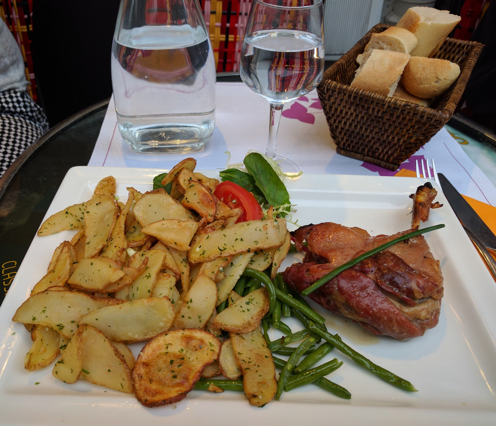

## ফ্রান্স - ৭ 

দেড়দিনে কোনো বড় শহরই ভালো করে ঘুরে দেখা সম্ভব নয়, প্যারিস তো নয়ই। কিন্তু উপায় কী? সাধ্যের মধ্যেই সাধ-পূরণ করতে হবে। তাই hop-on hop-off বাসে চড়ে সকাল থেকে গোটা প্যারিস ঘুরে বেরিয়েছি। এই বাসের চারটে আলাদা রুট। আমি বিকেলের মধ্যে সবকটাই দেখে নিলাম। রুট পালটানো ছাড়া বাস থেকে বিশেষ নামিনি। মাঝে শুধু নত্রদাম ক্যাথিড্রালের ভেতরটা ঘুরে দেখে এসছি। কারণ ফ্রি অ্যাডমিসন এবং অপেক্ষাকৃত ছোট (মাত্র আধঘণ্টা)  লাইন । বাদবাকি সব ট্যুরিস্ট স্পট বাস থেকেই দেখে নিয়েছি। লাইনে দাঁড়িয়ে ভেতরে ঢোকার চেষ্টাও করিনি।  

যেমন ধরো, লুভ্‌র। পৃথিবীর সবচেয়ে বড় মিউসিয়াম। ঘুরে ঘুরে দেখতে গেলে এক সপ্তাহেও শেষ হবে কিনা সন্দেহ। আমি কয়েক ঘণ্টায় কতটুকুই বা দেখে উঠতে পারব? শুধু মোনালিসার সাথে সেলফি তোলার জন্য খামোকা সময় আর ইউরো খরচ করার মানে হয় না। 

তাড়াতাড়ি করে বাসভ্রমণ বিকেলের মধ্যে সেরে নিলাম, কারণ তারপর আবার মঁমার্তে একটা ওয়াকিং ট্যুরের টিকেট কেটেছিলাম। উত্তর প্যারিসের মঁমার্ত টিলাকে কেন্দ্র করে এই মঁমার্ত অঞ্চল। এককালে শহরের যত শিল্পীদের ঠাঁই ছিল এখানে। প্যারিসের নামকরা সব নাইটক্লাবগুলোও যে এ চত্বরেই - সেটা আদৌ কাকতালীয় নয়। 

ঘুরে ঘুরে দেখলাম মুলাঁ রুজ (Moulin Rouge), "আমেলি" সিনেমার সেই "ক্যাফে দে ২ মুলাঁ" (Café des 2 Moulins), ভ্যান গঘের ভাইয়ের বাড়ি (যেখানে ভ্যান গঘ বছর দুয়েক থেকেছেন), মুলাঁ দ্য লা গ্যালেৎ (Moulin de la Galette), ছিন্নমস্তক সন্ত দেনি-র মূর্তি, পিকাসোর পছন্দের ক্যাবারে Lapin Agile (দুরন্ত খরগোশ) - বা মতান্তরে pun করে Lapin à Gill (মানে গিল-এর খরগোশ; শিল্পী গিলের এঁকে দেওয়া, ফ্রাইং প্যান থেকে লাফ দিয়ে পালানো এক খরগোশের ছবি থেকেই ওই নাম), “স্যাক্রে ক্যর” ব্যাসিলিকা (Basilique du Sacré-Cœur), আরও কত কী! 

গাইড ছেলেটি অল্পবয়সী, বছর পঁচিশের। কলাম্বিয়া থেকে প্যারিসে এসেছে ফিল্ম স্টাডিস নিয়ে পড়াশোনা করতে। হাতখরচ জোটানোর জন্য এই freelance গাইডগিরি করে। ট্যুরের শেষে বলল যে ফরাসি রান্না যদি চেখে দেখতে চাও তাহলে এই অঞ্চলই ভালো; এখানে দাম তবু ঠিকঠাক, সেন্ট্রাল প্যারিসে রেস্তোরাঁয় ঢুকলে একেবারে গলা কেটে নেবে। আমি ভেবে রেখেছিলাম সাবওয়ের স্যান্ডুইচ খেয়ে খেয়ে এক সপ্তাহ কাটিয়ে দেব, তাতে কিঞ্চিৎ ব্যায়-সঙ্কোচ হবে। কিন্তু গাইডের কোথা শুনে মনে হল একদিন অন্তত নিজেকে একটু তোয়াজ করা যেতেই পারে। 

দেখেশুনে একটা ভালো ফরাসি রেস্তোরাঁয় ঢুকে পড়লাম। নাম Le Relais Gascon, যদি কেউ যেতে চাও। ঢুকে পড়লাম বলা ভুল। রেস্তোরাঁর ভেতরে সব টেবিল ভর্তি। বাইরে ফুটপাথে এদিক ওদিক পাশের আরও দুই দোকানের জায়গা জবরদখল করে একসারি টেবিল পাতা। সেগুলোও প্রায় সব ভর্তি, ভাগ্যক্রমে একটা খালি ছিল বলে আমাকে আর দাঁড়িয়ে থাকতে হয়নি। মেনু দেখে অর্ডার দিলাম Confit de canard. বিবরণে লেখা ছিল - বহুক্ষণ ধরে জারিয়ে রাখা হাঁসের মাংস, তারপর ওই হাঁসেরই চর্বি দিয়ে রান্না করা। ওহ, সে কী খেতে! নরমমম তুলতুলে। এত নরম যে ৩টে ম বসাতেই হল। খেয়ে দিল খুশ হয়ে গেল! 

এত কম সময়ে - আনন্দবাজারের ভাষায় ঝটিকা সফরে - প্যারিসকে যতটা দেখে বুঝে নেওয়া সম্ভব, তার সবটুকু চুটিয়ে চেখে নিয়েছি। শুধু একটাই দুঃখ রয়ে গেল। প্যারিসের লাইব্রেরি দেখা হল না। এখানকার লাইব্রেরির খ্যাতি প্রবাদপ্রতিম। সেই ছোটবেলা থেকে শুনে আসছি, প্যারিসে নিজের বই নিয়ে আসার মতো বলদামো নাকি আর হয় না! 

* * *

(সমাপ্ত)

* * *

[Archive](../archive)
