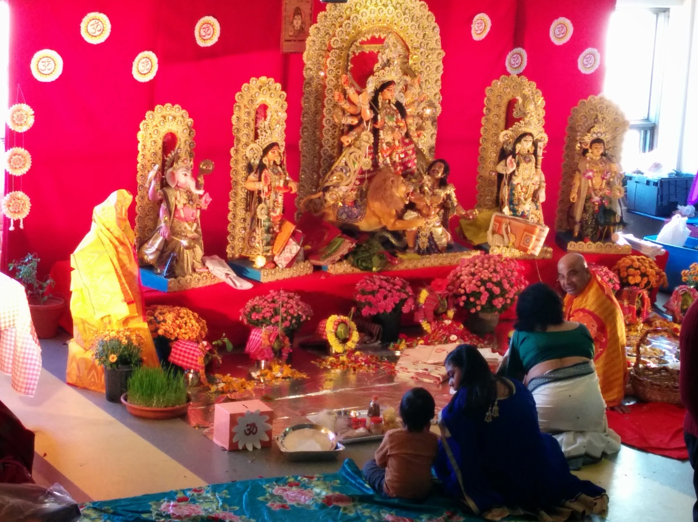
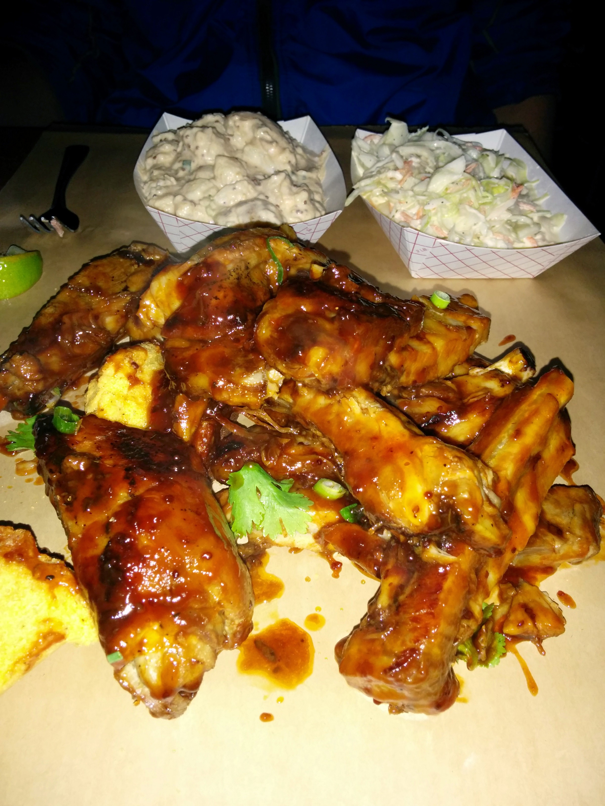
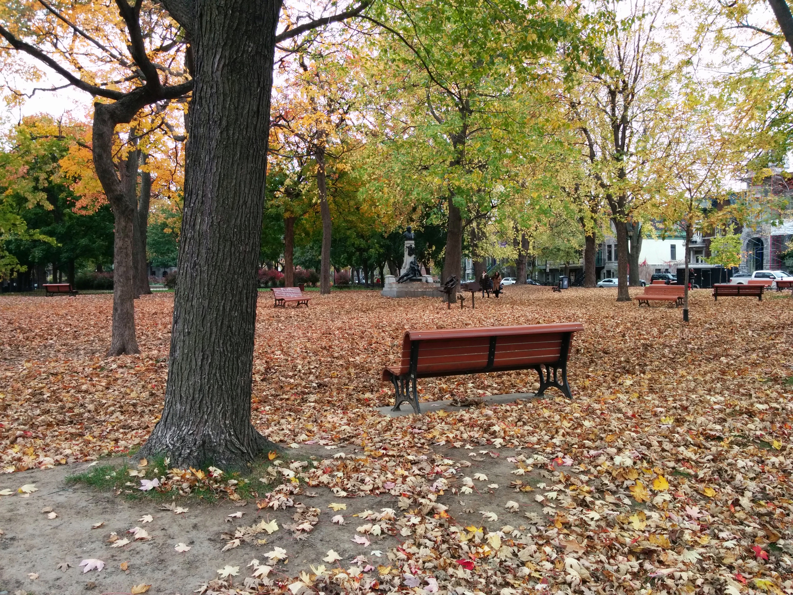

## \_Bengali\_ Bilet - Pujor Bonus

*Note: This post is written in Bengali language, but in Latin script. All similar posts are marked with a \_Bengali\_ tag in the title.*

Likhbo likhbo koreo r hoe uthchhe na. Edike pujo shesh hoe Kalipujo eshe galo praye. Aar bolar mawto kothao jome gachhe prochur.

Ebar prothombar pujo te kolkatar baire aachi. Tobu besh bhaloi kaatlo kintu. Ekhankar baangali dada didi der saathe double pujo porikroma holo - ekbar sothik din-khon mene, r ekbar Thanksgiving er long weekend e "made easy" style e. 

")

Kolkatar pujor saathe tulona tanar maane hoy na, tai osober moddhe jachhi na. Tobe - onjoli, bhog, khichuri, adda, 29, lyaad - sob milie pujo pujo amej ta sholo aana peyechhi.

Obossho pujo maanei sobsomoye shantipurno bataboron noy. Doshomir sondhebela Debi boron r Didi der sindur khela cholchhe, blog e biboron debo bole ami ektu dure daarie dekhchhi - maane jaake journalism er bhashaye bole khas field e neme cover kora. Emon somoye - kaane elo gujguj fisfis - porokkhonei jhotika akromon! Pechhon theke haat chepe dhore amake laalmukho banie chharbe - ei hochhe Didi der plan. Konomote haat chharie sekhan theke pakal maach er mawto pichhle berolam. Shotrupokkho tokhonkar mawto haar maanlo bote, kintu bujhlam e hochhe feigned retreat - ektu porei abar akromon haanbe.  
Tarpor i dekhi ek Didi dolchhut hoe khub aanmona bhaab kore ghurpothe edike aaschhe. Aar baki dujon aar ek kone ot pete aache. Tobe ei shorma ke konthasa kora oto o soja noy ko! Next 5 min er dribble dekhle Maradona amake kole tule ador korten.  
Kintu trifola akromoner saamne eka Kumbho r kotokkhon lorbe? Shesh obdhi laalmukho hoei sedin bari firlam.

Desh theke bondhura santona dichhe "aha bechara, pujo te baire pore aachis". Mabhoi! Chintar karon nei. Dibbi aachi.  
Ekhane dada didi der kachhe sneho r jompesh ranna kheye ekadhare rhishto r pushto hoe cholechhi. Ei to sedin weekend e dudin dhore theshe khelam lamb r ilish. (R beshi detail bolle pathok ra nojor die deben). Bidesh bnibhui e eshe erom abdar korar jayega pawa chattikhani kotha noy!

Er maajhe abar amar jonmodin galo. Majhraate roommate ra chomke dilo - aage theke lukie rakha cake, icecream r Malibu rum hajir kore.  
Dinner ta baire sara holo. Icehouse bole ekta restora te gie chutie khawa holo pork ribs, chicken wings r beef burrito. Saathe Lemonade Bourbon. Sworgiyo!  
Khete ato byasto chhilam j chhobi tolar fursot paini. Dekhlam Icehouse thala falar dhar dhaare na. Kolapatar style e pellaye ekta kagoj pete tar uporei pork ribs er baalti upur kore dilo. Amrao haat lagie chetepute khelam - knife fork chawar kotha moneo aasheni.

\[**Update:** Icehouse er khabar er chhobi dei ni bole onek kotha shunte hoechhe bondhuder kaachhe. Tai baddho hoe ei shukrobar raate Deepaboli palon korte abar hana dilam Icehouse e (Ebar khali pork ribs). Tachhara nishtha bhore mangso na khele Maa Kaali raag korte paaren, sei bhoy tao chhilo.\]

Edike abar gawto koekdin e rastaghaat er chehara paalte gachhe. Fall color byapar ta addin calendar er patatei dekhe eschhi khali. Kintu chakkhush na dekhle bhol-bodol ta thik bojhano jabe na. Kodin aager sobuj gachh gulo ekhon hoy pata jhorie khangra kathi, noyto laal holud komolaye mukh dhekechhe. R rasta jure khali laal holud Maple er gaalicha.

* * *

[Archive](../archive)

