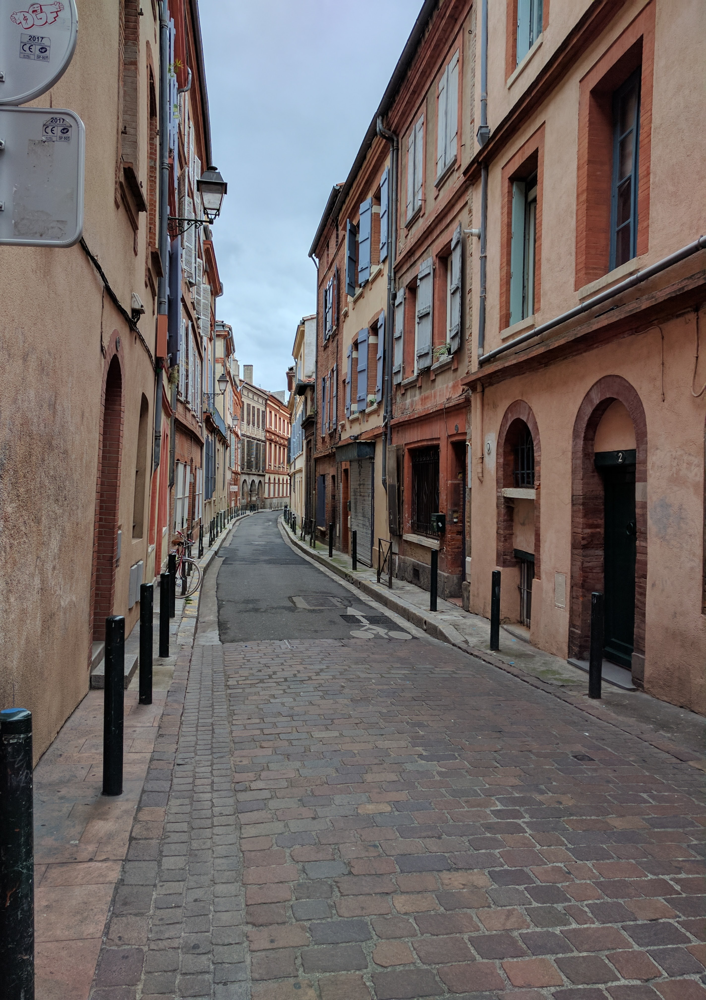

## ফ্রান্স - ৩

তুলুস। 

সকাল সকাল জলখাবার খেয়ে বেরিয়ে পড়লাম শহর দেখতে। আমাদের সবাইকে এক সপ্তাহের জন্য মেট্রো-ট্রাম-বাসের একটা ফ্রি পাস দিয়েছে, কিন্তু ফেলুদা বলেছে পায়ে হেঁটে না ঘুরলে শহর চেনা যায় না। 

বিদেশে অজানা অচেনা শহরে একা একা ঘুরে বেড়ানোর মধ্যে একটা অদ্ভুত রোমাঞ্চ আছে। তবে কিনা, ইয়ে, পকেটে গুগল ম্যাপ্স থাকলে আর কোনই টেনশন থাকে না। ফ্রান্সে এসেই একটা লোকাল সিম কিনে নিয়েছিলাম। এখানে ফোন আর কাকে করব? কিন্তু ডেটা প্যাকটা খুব কাজের জিনিস।

ব্যাঙ দেখেছ তো? ওরা মোটামুটি তিন রকমের হয়। পাতি ব্যাঙ, কুয়োর ব্যাঙ, আর কলকাতার ব্যাঙ। কুয়োর ব্যাঙরা বাইরে যায় না; আর কলকাতার ব্যাঙেরা বাইরে যেখানেই যাক না কেন, একচিলতে কলকাতা দেখতে পায়। মন্ট্রিয়লে প্রথমবার Jacques Cartier ব্রিজ দেখে আমিও "সবুজ রঙের হাওড়া ব্রিজ!" বলে খুব চেঁচামেচি করেছিলাম।

তুলুসের সরু গলিগুলোতে ঘুরতে ঘুরতে কেমন একটা উত্তর কলকাতা গোছের আমেজ পেলাম। তার উপর জানলায় জানলায় খড়খড়ি - যেমন আমাদের স্কুলে ছিল। তবে নদীর ধারে গেলে খানিকটা যেন চন্দননগর। 

তুলুস এমনিতেই পুঁচকে শহর। তার উপর আমি ইচ্ছে করেই শহরের জমজমাট ট্যুরিস্ট স্পট আর বাজারগুলো এড়িয়ে অলিতে গলিতে হেঁটে বেড়াচ্ছি। লোকজন তাই খুব একটা চোখে পড়ছে না। ভালোই লাগছে। আমার ছোটবেলার গরমের ছুটির দুপুরগুলোও এইরকম থাকত। শান্ত, নিঝুম। 

* * *

[(চলবে)](../posts/2017-07-10-France-4)

* * *

[Archive](../archive)
