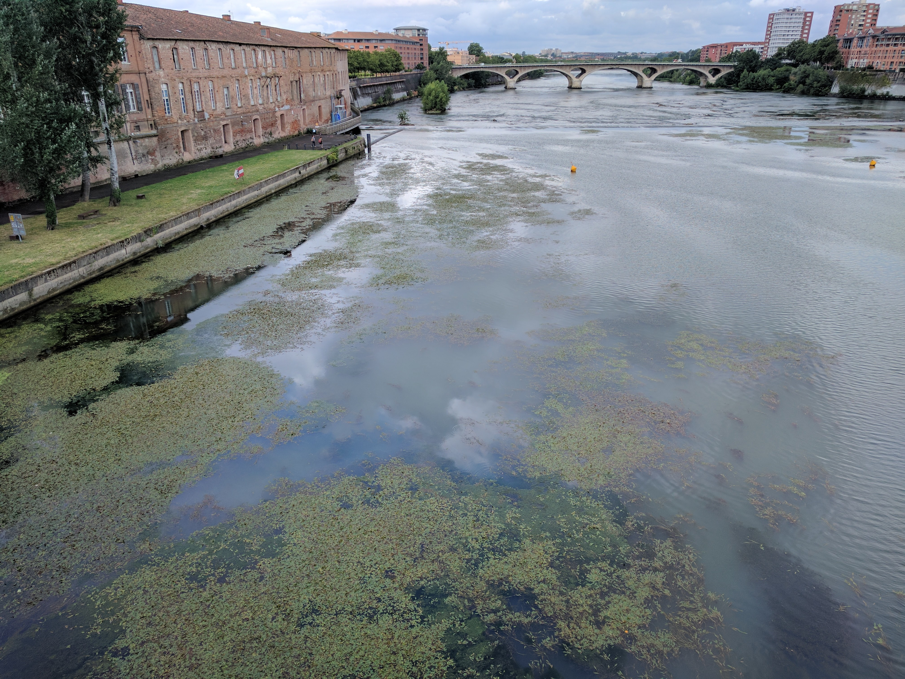

## ফ্রান্স - ৪

কনফারেন্স উপলক্ষ্যে তুলুসে প্রায় হাজার তিনেক লোক এসছে। পথে ঘাটে, বিশেষ করে মেট্রোতে, গলায় নীল রিবন ঝোলানো কনফারেন্সের ব্যাজওয়ালা জনতাই চোখে পড়ছে যেন খালি। তার মধ্যে বেশ কিছু দেশি চেহারা, দল বেঁধে চলেছে হিন্দিতে কথা বলতে বলতে। আমি আর যেচে আলাপ করতে যাইনি। ম্যাকগিল থেকেও বেশ কিছু চেনা মুখ এসেছে, তাদেরও এড়িয়ে চলছি। ফ্রান্সে এসে যদি দল পাকিয়েই ঘুরবো, তাহলে আর কীসের solo travel?

অলি গলি ঘুরতে ঘুরতে একটা খাল চোখে পড়ল। গুগল ম্যাপ্স বলল এটা Canal de Brienne, এখান থেকে খাল বরাবর মিনিট পনেরো গেলেই গ্যারোন নদী দেখতে পাব। সেইমতো হাঁটা লাগালাম।

খাল আর নদীর মাঝে একটা লক গেট, নাম Ecluse Saint-Pierre. সেখানে বেশ কিছুক্ষণ ক্যামেরা তাক করে দাঁড়িয়ে রইলাম, যদি ঘন সবজে জলের মধ্যে থেকে কোনো জলজ জন্তু মাথা তোলে। সেরকম কিছুই চোখে পড়ল না, নয়তো ফেসবুকে "খাল কেটে কুমির" শিরোনামে ছবি ছেড়ে ফাজলামো মারা যেত।

মূল গ্যারোন নদীতেও বেশ কয়েকটা লক গেট দেখলাম। সেইজন্য স্রোত কম বলেই বোধহয় নদীর জলে দলা দলা শ্যাওলার ঝাঁক। দেখে বেশ মজা লাগল। ফ্রান্সের নদী ভাবলে আর যাই হোক শ্যাওলার কথা মাথায় আসে না। সিনেমাতেও খালি টলটলে জলই দেখায়। তাই ছবি তুলে "ফরাসি ছাতলা" বলে ফেসবুকে দিয়ে দিলাম। ভাবলাম জনগণ বেশ আমোদ পাবে; নয়তো এমনিতে এই ছবিটা আহামরি কিছু না। কিন্তু দু-তিনজন বাদে বেশিরভাগ জনতাই দেখলাম লেখাটা খেয়াল না করে শুধু ছবি দেখে লাইক মেরে বেরিয়ে যাচ্ছে। একজন তো বলেই ফেলল, কী এমন জিনিস এটা? এই ছবি দেওয়ার মানে কী?

আ মোলো যা!

* * *

[(চলবে)](../posts/2017-07-10-France-5)

* * *

[Archive](../archive)
